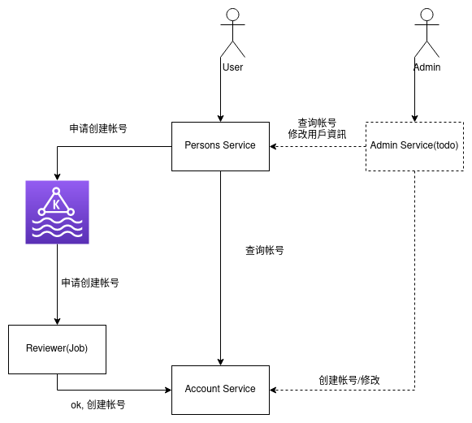

# Final Project

[v] 微服务架构（BFF、Service、Admin、Job、Task 分模块)\
    todo:\
    - Admin\
    - Job with kratos layout

[v] API 设计（包括 API 定义、错误码规范、Error 的使用） \
    todo:
    - error design
[v] gRPC 的使用 \

[v] Go 项目工程化（项目结构、DI、代码分层、ORM 框架）

[ ] 并发的使用（errgroup 的并行链路请求

[v] 微服务中间件的使用（ELK、Opentracing、Prometheus、Kafka
    todo:\
    - traceid

[ ] 缓存的使用优化（一致性处理、Pipeline 优化